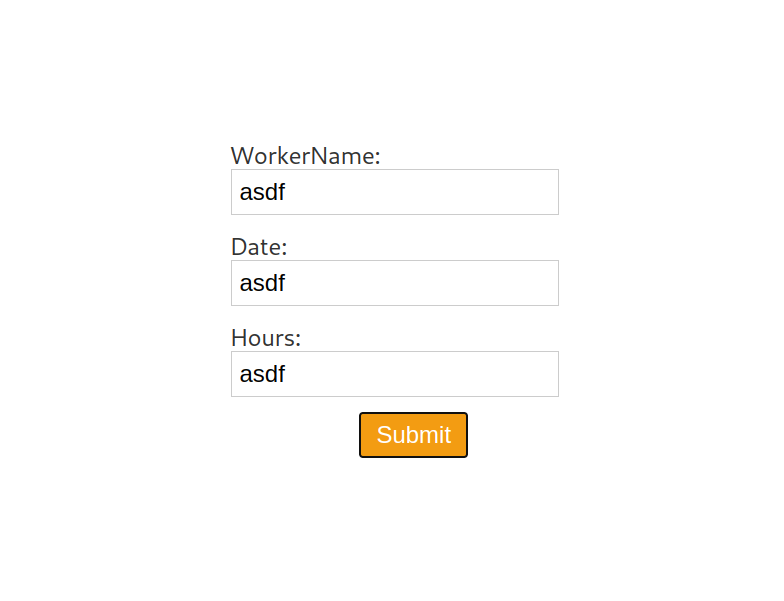

# Netsuite like app that takes workerName, date and hours worked and puts into mongoDB collection

## What works as of now:
- backend server, to run it simply us `go build -o backendServer` and  `./backendServer -m <mongoDB_key>
- simple frontend with React to put data to Golang web server

## React client:
- `npx create-react-app svelte-client` to create app
- `npm run dev` to run the app

